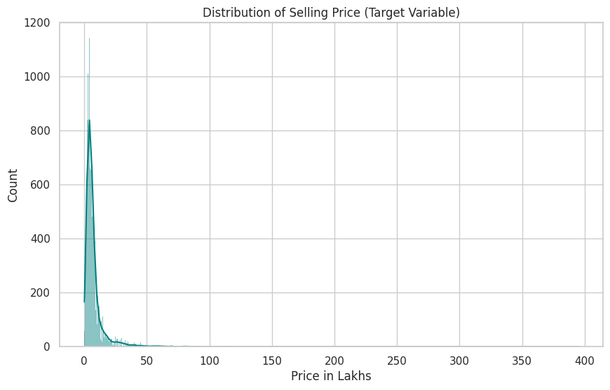
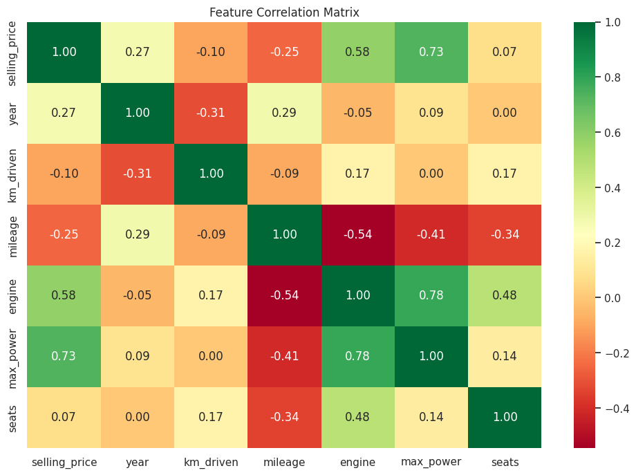
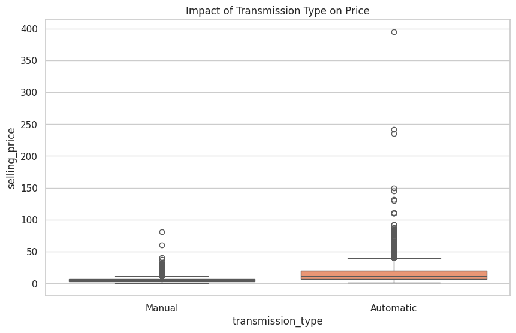

# cars-24-analysis
## An end-to-end Exploratory Data Analysis (EDA) on a dataset of ~20,000 used car listings from Cars24.

## Project Overview
### This project performs an end-to-end Exploratory Data Analysis (EDA) on a dataset of ~20,000 used car listings from Cars24. The objective is to identify the primary drivers of vehicle resale value and provide data-backed insights for pricing strategies.

## Key Findings
### - Performance vs. Price: 'Max Power' emerged as the strongest predictor of price, even more so than the car's age.
### - Transmission Premium: Automatic vehicles command a significant price premium (median ~55% higher) over manual counterparts.
### - Depreciation Curve: Vehicles manufactured within the last 5 years account for the majority of high-value transactions, showing a steep drop-off after the 7-year mark.

### 📊 Data Insights & Visualizations

#### 1. Price Distribution
The market is dominated by budget-friendly cars, with a significant concentration in the 3–8 Lakh range.

#### 2. Feature Correlations
We found that 'Max Power' and 'Engine' size have the strongest positive correlation with the selling price.

#### 3. Transmission Impact
Automatic cars command a premium resale value compared to manual models across all age groups.

## Repository Structure
### - data/: Contains the cars24-car-price.csv dataset.
### - notebooks/: Includes the .ipynb file with step-by-step EDA.
### - visuals/: Saved .png files of the correlation heatmap and distribution plots.
### - README.md: Project documentation.

## Data Pipeline & Methodology
### 1. Data Cleaning
### - Verified 19,980 records for consistency.
### - Standardized categorical variables (Fuel Type, Transmission).
### - Handled outliers in the selling_price column to prevent model bias.

## 2. Exploratory Data Analysis
### - Focused on uncovering hidden patterns through:
### - Univariate Analysis: Price and Mileage distributions.
### - Bivariate Analysis: Fuel Type vs. Selling Price.
### - Multivariate Analysis: Heatmaps to identify feature interactions.

## Visualizations
### - Feature Correlation
### The correlation matrix revealed that Engine Capacity and Max Power have the highest positive impact on price, while Kilometers Driven has a notable negative impact.

### - Price by Transmission Type
### Visualized using box plots to show the spread and outliers in the luxury automatic segment.

## Future Scope
### - Predictive Modeling: The next phase involves using PyTorch to build a Regression model (as discussed in my previous roadmap) to predict car prices with higher precision.
### - Web Deployment: Creating a Streamlit dashboard for real-time price estimation.

### Contact: Abhay Kumar Sharma, abhaymactavish@gmail.com
### Linkedin: www.linkedin.com/in/abhay-kumar-sharma-a22a94171
